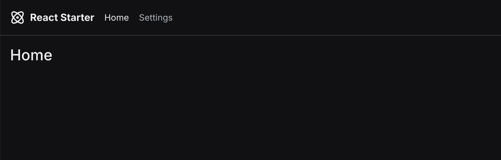

# React Starter

A minimal template to get started with React.

**Tech Stack**

1. Framework: React 18 + Vite + React Router
2. Styling: Plain CSS
3. Linting: Code Shaper ESLint configuration



## Development Build

```shell
npm ci
npm run dev
```

Now point your browser to http://localhost:3000

## Production Build

```shell
npm ci
npm run build
npm run preview
```

Now point your browser to http://localhost:3000

## All Commands

```
npm ci                   # install dependencies
npm run build            # builds all workspaces
npm run clean            # deletes all build artifacts
npm run dev              # run the dev build
npm run fix              # lints, formats and attempts to fix any issues (requires `npm run build` has been ran)
npm run lint             # runs the linter on all workspaces, useful for debugging lint issues (generally `npm run fix` is preferred)
npm run preview          # run the prod build
```
